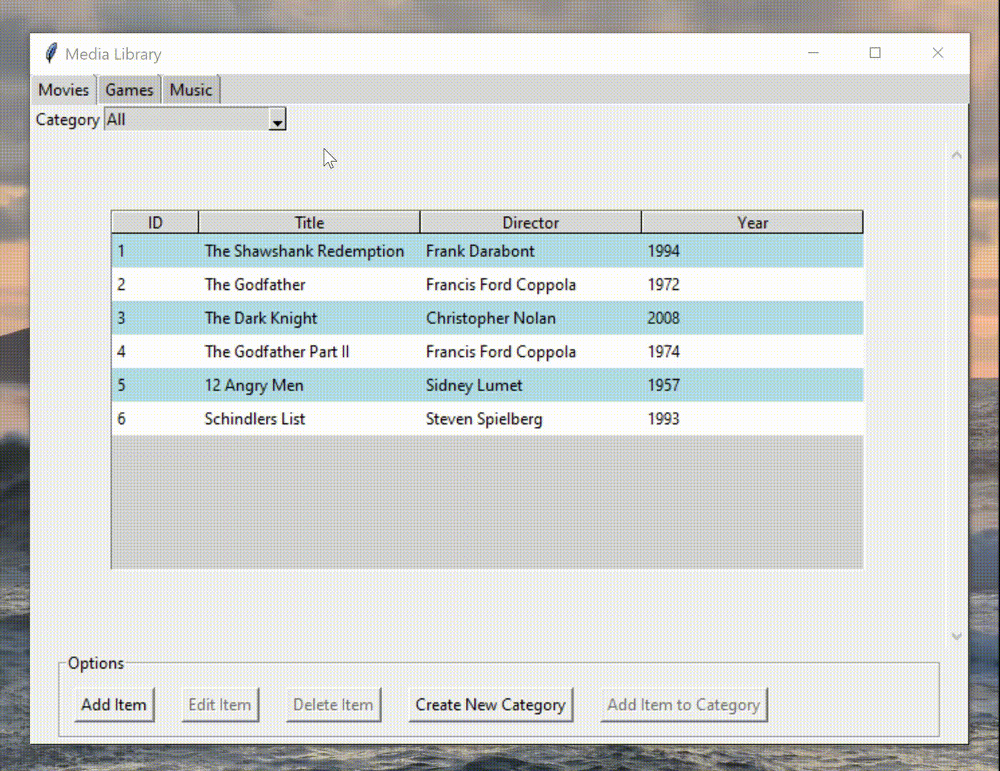
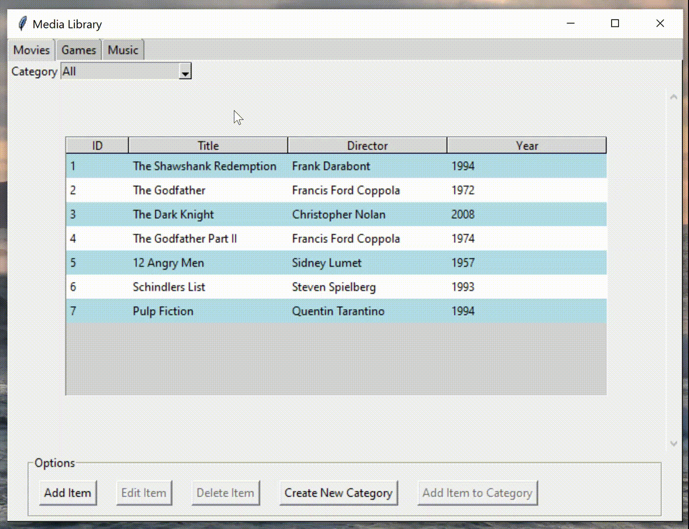
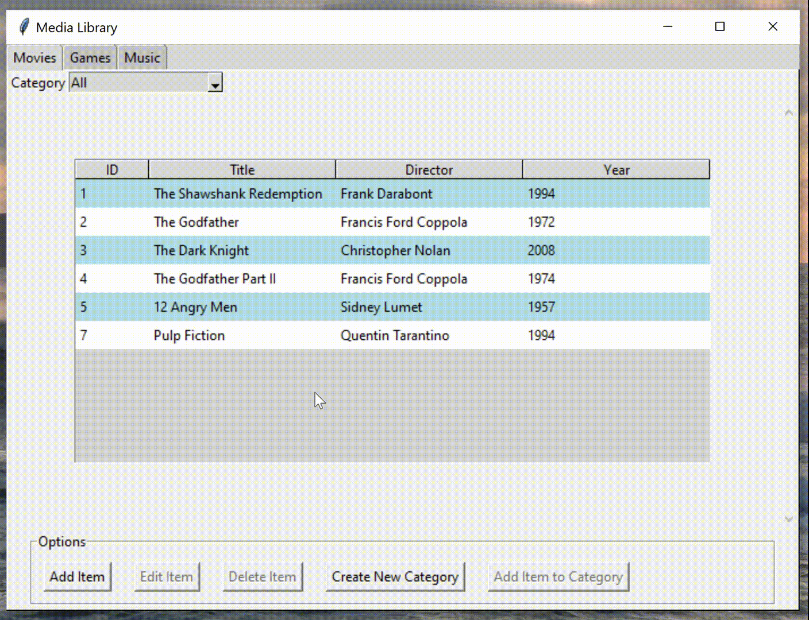
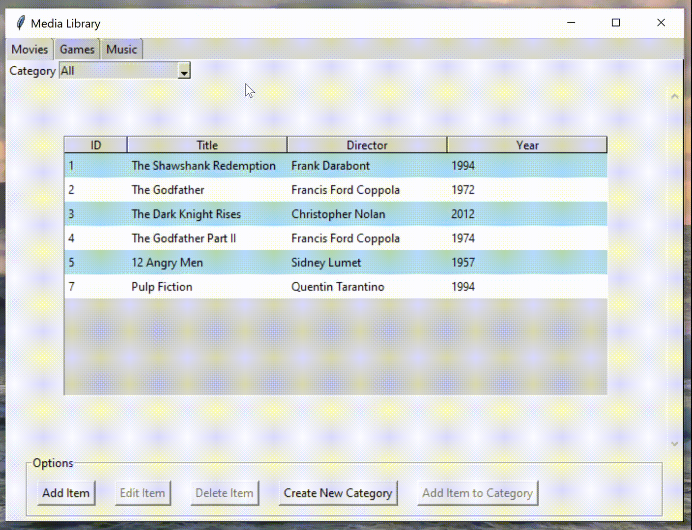

# Media Library
### Requirements
Python Version: 3.10.8
OS: Windows 10 64bit

The following modules form the Python Standard Library are used:
* abc
* sqlite3
* tkinter

If running unit_tests.py, the following modules from the Python Standard Library are alse used:
* unittest
* datetime
* os

No other libraries are used.

### Run instructions
After cloning this repository, in the command prompt, navigate to the same directory as media_gui.py and run the below command. 

```python media_gui.py```

Note that there is an example database in the repo to make it easier to explore the application. If you want to explore the empty media library, please delete "media.db".

### Testing
I implemted a couple of unit tests for checking the database operations. These can be found in "unit_tests.py". With more time, I would increase the test coverage.

### Usage instructions

##### Adding new media


##### Deleting media


##### Editing media


##### Creating and adding to categories


##### Viewing media


### Limitations and Improvements
There nothing to stop the user from opening multiple windows (e.g. Add and Edit windows). I haven't tested what kind of errors this can cause.

There is minimal checking for correct user input:
- Special characters marks can't be used in category names or record details
- There check for input type e.g. if possible to cast to int.

I could fix these with a bit more time.

### Skills shown
* Array or List: Numerous examples of lists used.
* Loop: Numerous examples of loops used
* Method: Method are used in classes
* Class: Classes are used for the GUI, for database operations and for testing
* Interface: Interface define for database operation classes in media_classes.py
* Encapsulation: Used in all classes.
* Abstraction: Shown with some private methods and attributes in classes but this could definitely be improved upon.
* Comment: Used throughout code.
* Inheritance: Used in MediaTab classes. Movies and Games inherit from Music
* Polymorphism: Same method names with different behaviours are used in MediaTab classes
